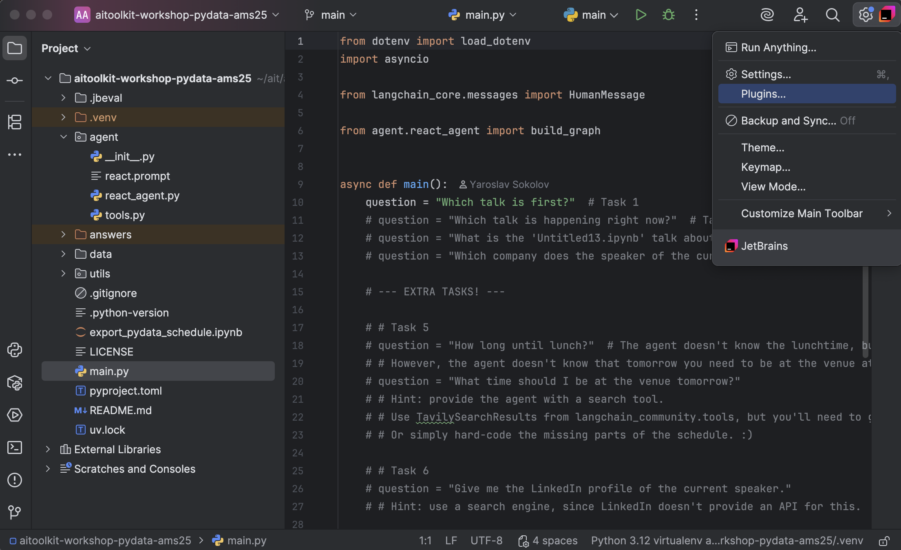
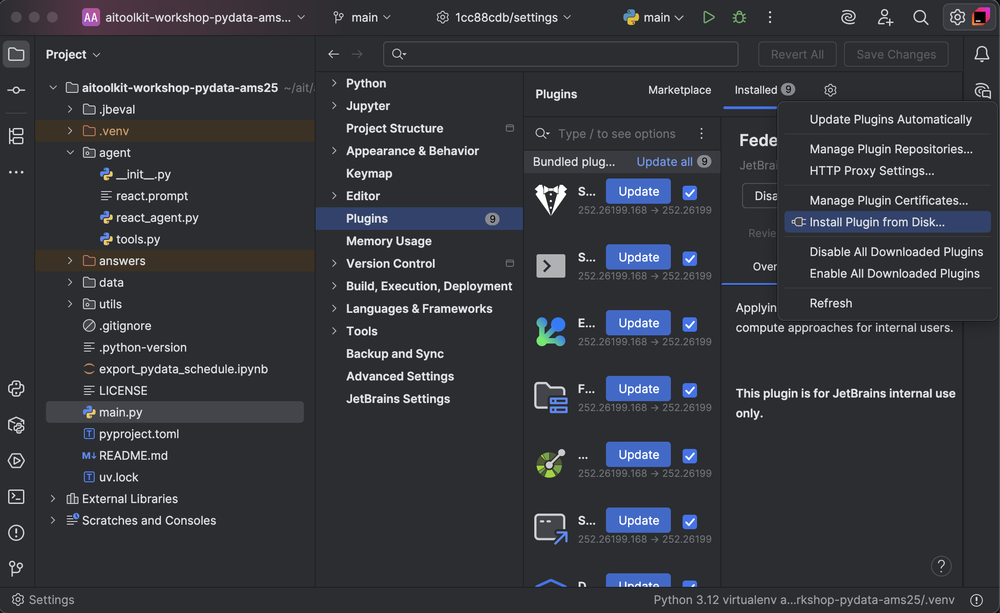
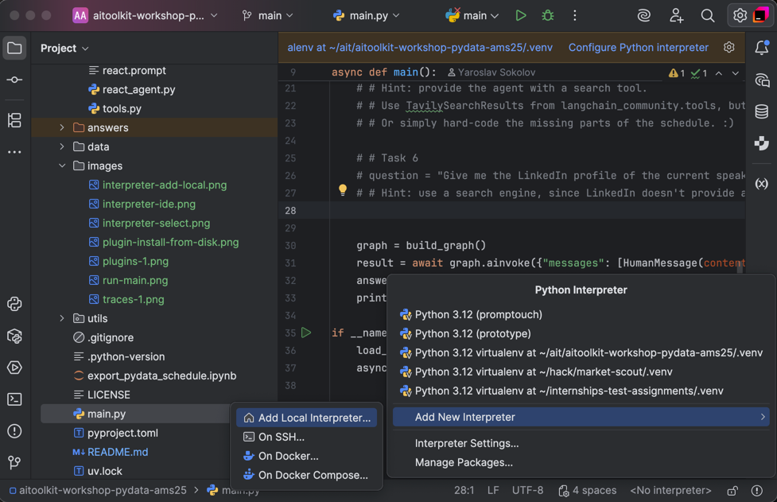
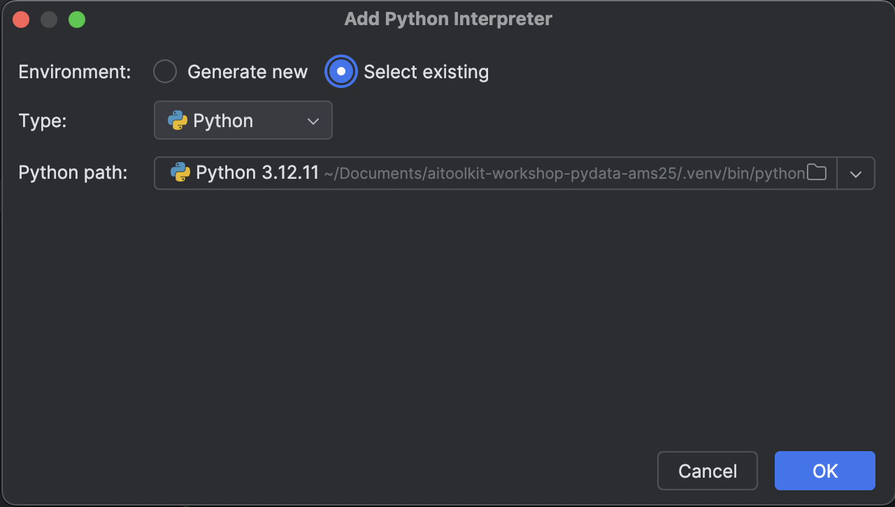
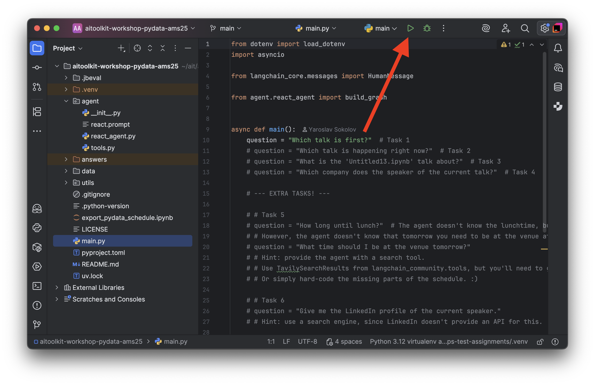
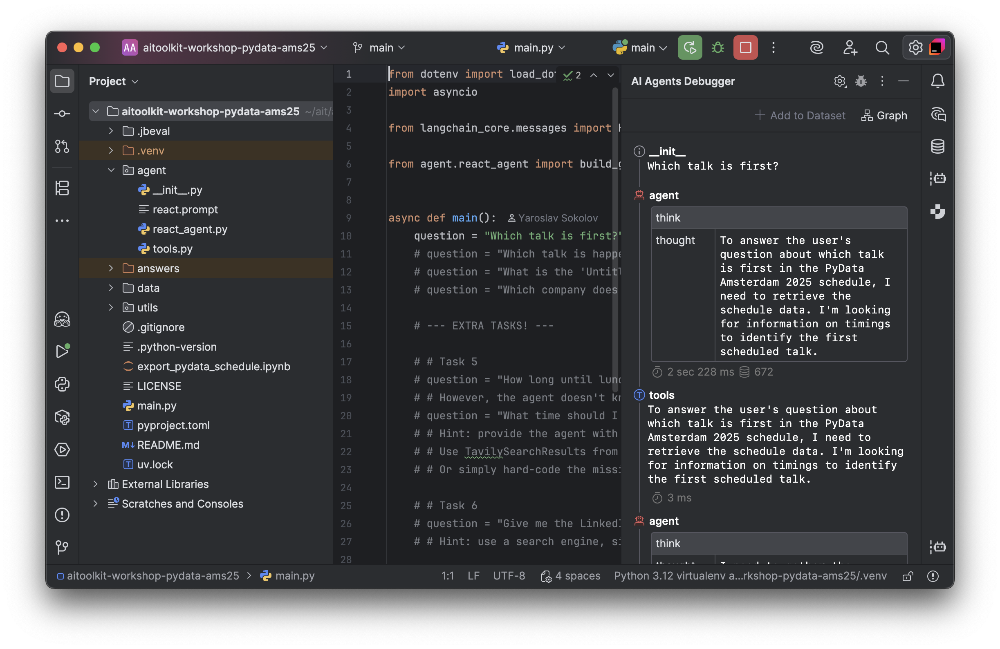

# AI-Toolkit Workshop PyData Amsterdam 2025  

## Install PyCharm  

[Download](https://www.jetbrains.com/pycharm/download) and install standalone PyCharm.  

## Install AI Agents Debugger Plugin

Download the zip archive of the plugin: [link](https://drive.google.com/file/d/1mgyU7oQlVn4qCaSuKvMvZBCpHoz77dL0).  
Then install it manually: 
 * Go to PyCharm
 * Settings (gear icon top-right corner) --> `Plugins`  
    
 * Gear icon (top-right-ish) --> `Install Plugin from Disk…`  
     
 * Choose the downloaded .zip
 * `Save changes` (top-right)  

## Configure Python Environment  

Go to the project's root directory.  
First, [install uv](https://docs.astral.sh/uv/getting-started/installation/) if you haven't already.  
Install Python via uv:  
```bash
uv python install 3.10
```  
Install project dependencies:  
```bash
uv sync --all-packages --all-extras
```
Python virtual env `.venv` should appear in the project's root directory.  

### Configure Pytnon interpreter in PyCharm  

Click the interpreters section in botton-right of the screen:
Then choose `Add New Interpreter` --> `Add Local Interpreter...`:  


The choose `Select existing` interpreter and then find your interpreter in local `.venv/bin` folder, then click OK:  


## Test the plugin  

Run the `main` Run Config:  


You should see the AI Agents Debugger tool window on the right:  
 
